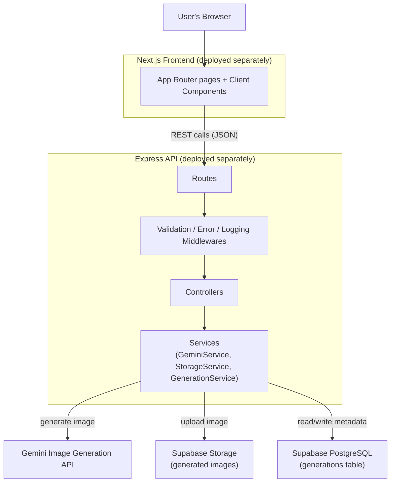

# System Architecture

## Why this shape

- **Frontend never touches Gemini or Supabase directly.** The `GEMINI_API_KEY` and the Supabase
  `service_role` key both live only in the backend's process environment. The frontend only ever
  calls the backend's own REST API, so neither secret can leak into browser network traffic or
  client-side JS bundles.
- **Services own the business logic, controllers stay thin.** `GeminiService` only knows how to
  call Gemini. `StorageService` only knows how to upload to Supabase Storage. `GenerationService`
  orchestrates the two plus the database and is the only place that decides what counts as
  "completed" vs "failed". Controllers just parse the request, call a service, and return the
  result — this keeps the failure-handling logic in one place instead of duplicated per route.
- **One database table, no queue.** Given the scope (single synchronous generate call, no
  background workers), a `generations` table with a `status` column is enough to represent
  processing/completed/failed without introducing a job queue that this project doesn't need yet
  (see [`decisions.md`](./decisions.md) for the tradeoff this implies).
