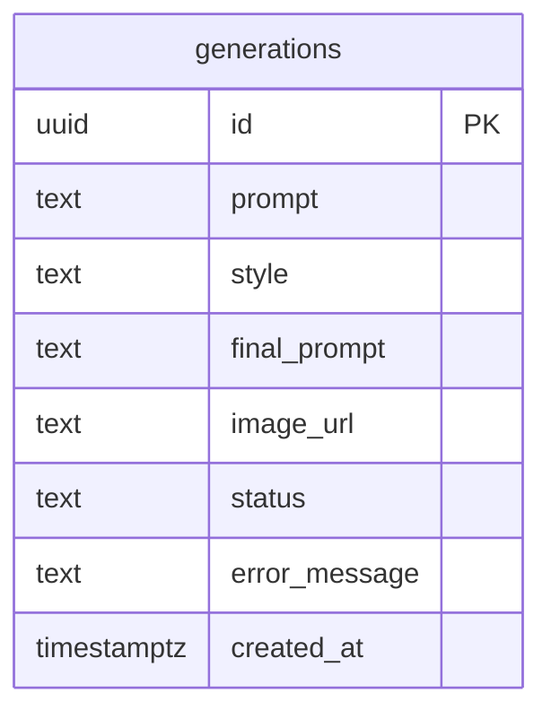

# Database Schema

## Columns

| Column | Type | Notes |
|---|---|---|
| `id` | `uuid` | Primary key, `gen_random_uuid()` default |
| `prompt` | `text` | The user's raw input, e.g. "Small living room with natural lighting and indoor plants" |
| `style` | `text` | One of `Modern`, `Scandinavian`, `Industrial`, `Japandi`, `Luxury` (checked via constraint) |
| `final_prompt` | `text` | `style` + `prompt` combined into the string actually sent to Gemini |
| `image_url` | `text` | Public Supabase Storage URL once generation succeeds; `null` while processing/failed |
| `status` | `text` | `processing` \| `completed` \| `failed` (checked via constraint) |
| `error_message` | `text` | User-facing failure reason; `null` unless `status = 'failed'` |
| `created_at` | `timestamptz` | Defaults to `now()`; the gallery is always sorted by this, newest first |

`error_message` is one addition beyond the spec's minimum column list — it's what lets a failed
generation still show *why* it failed in the gallery instead of just a bare "failed" badge.

See [`supabase/migrations/001_create_generations_table.sql`](../supabase/migrations/001_create_generations_table.sql)
for the exact DDL, including the storage bucket + RLS policies.
