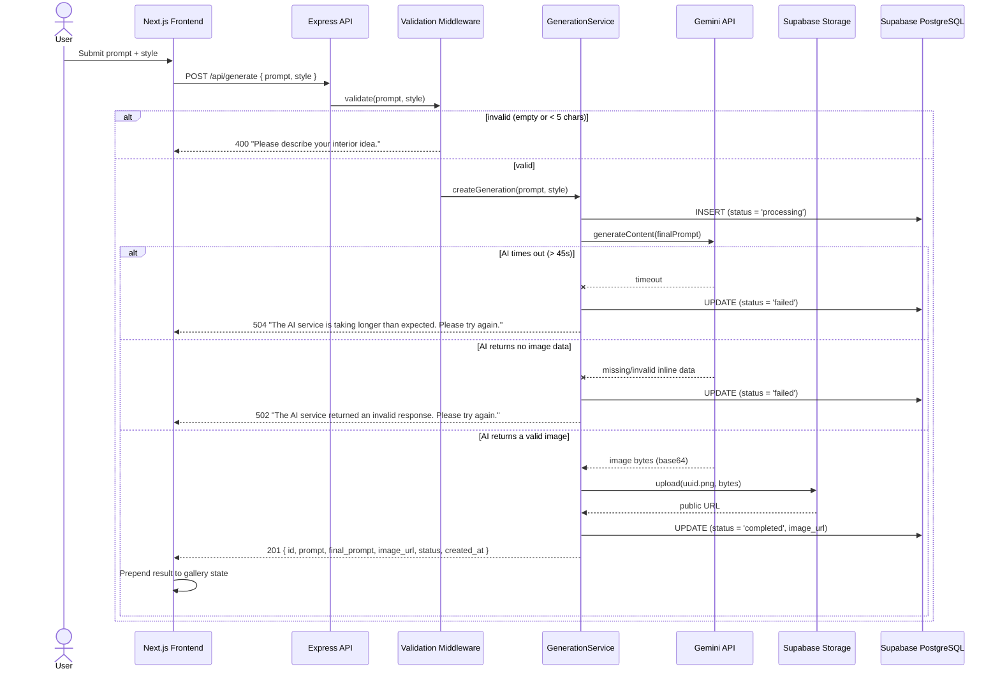

# Request Journey — `POST /api/generate`

## Notes

- The request is **synchronous end-to-end** — the frontend's `fetch` call stays pending for the
  full 10–30 seconds of generation and resolves once the image is uploaded and the database row
  is updated. There's no polling or webhook step; see [`decisions.md`](./decisions.md) for why.
- A database row is created (`status = 'processing'`) **before** the Gemini call, so even if the
  request fails, a `failed` row exists in the gallery — nothing is silently lost.
- `POST /api/generations/:id/regenerate` follows the identical path, except `GenerationService`
  first loads the original record to inherit its prompt/style, then runs a brand-new insert. The
  original row is never updated or deleted.
